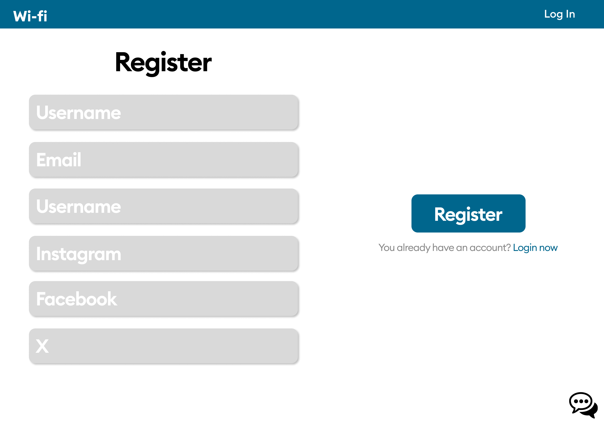

# Trendifyr - Frontend Documentation

## Overview

This is the frontend repository for the Trendifyr web application. This project is written in React Typescript.

## Table of Contents

- [Trendifyr - Frontend Documentation](#trendifyr---frontend-documentation)
  - [Overview](#overview)
  - [Table of Contents](#table-of-contents)
  - [Installation](#installation)
  - [Usage](#usage)
  - [Folder Structure](#folder-structure)
  - [Coding Standards](#coding-standards)
  - [Design Details](#design-details)
    - [Figma Design](#figma-design)
    - [Colors](#colors)
    - [Font](#font)
    - [Screencaptures](#screencaptures)
      - [Main Page](#main-page)
      - [Login](#login)
      - [Register](#register)
      - [User Page](#user-page)
      - [User Page not Logged in](#user-page-not-logged-in)
      - [Craft Your Post](#craft-your-post)

## Installation

This project requires `Node.js` and `npm`. You can download them from https://nodejs.org/.

```bash
# Clone the repository
git clone https://github.com/WiFi-G9/frontend.git

# Change into the project directory
cd frontend/g9frontend

# Install dependencies
npm install
```

## Usage
The development server will be started at http://localhost:3000.

```bash
# Development build
npm start

# Production build
npm run build
```

## Folder Structure
The project is organized with the following folder structure:

- **`/src`**: Contains the source code for the application.

  - **`/components`**: This directory houses React components used throughout the application. Each component contains a `.tsx` file and a `.css` file.

    - **`/AppMenu`**
    - **`/CookieManager`**: Helper component for handling cookies.
    - **`/Description`**
    - **`/GetFacebook`**
    - **`/GetX`**
    - **`/GetInsta`**
    - **`/InstagramButton`**
    - **`/LikesGraph`**
    - **`/Login`**
    - **`/PopularTrends`**
    - **`/Register`**
    - **`/SearchBar`**
    - **`/SendUsAMessageButton`**
    - **`/SimilarTrends`**
    - **`/ToggleButton`**
    - **`/ToggleButtonContent`**
    - **`/YourProfileButton`**

  - **`/pages`**: The primary pages reside here. Each component contains a `.tsx` file and a `.css` file.
    - **`/MainPage`**
    - **`/UserPage`**

- **`App.tsx`**: The main entry point for the application.

- **`index.tsx`**: The main index file rendering the React application.

## Coding Standards
- Each component must have its own file (e.g. `MyComponent` is implemented in `MyComponent.tsx` and `MyComponent.css`)
- File names: PascalCase (e.g. `MainPage.tsx`)
- Components: PascalCase (e.g. `StatisticsComponent`)
- Variables: camelCase (e.g. `myVar`)
- Functions: camelCase (e.g. `myFunction()`)
- Event handler functions: should be prefixed with `handle` (e.g. `handleButtonClick()`)
- State handler functions: should be prefixed with `set` (e.g. `setActive()`)
- CSS class names: lowercase and hyphens (e.g. `searchbar-container`)
- Constants: uppercase snake_case (e.g. `MY_CONSTANT`)

## Design Details
### Figma Design
Explore our Figma design for a visual representation of the app's user interface: [Figma Design Link](https://www.figma.com/file/Uh9vPARq5iD8mRhU4EEG5T/Untitled?type=design&node-id=0%3A1&mode=design&t=Pcyr72X5dgWLsinH-1).

### Colors

- **App Bar:** `#2F668D` 
- **Background:** `#FFFFFF` 
- **Search Bar and Toggle Group:** `#E9E9E9` 
- **Socials Toggle Buttons Margin:** `#DADADA` 
- **Socials Toggle Buttons Margin (Hover):** `#5C62EC` 
- **Graphs Toggle Buttons Margin:** `#4446A5` 
- **Left Container:** `#A6C8C9` 

### Font

- **Font:** [Inter](https://fonts.google.com/specimen/Inter?preview.text=WiFi)
- **Css Rule:** `font-family: 'Inter', sans-serif;`
- **Font Color:** Alternates between black and white.

### Screencaptures

#### Main Page


#### Login


#### Register


#### User Page


#### User Page not Logged in


#### Craft Your Post
