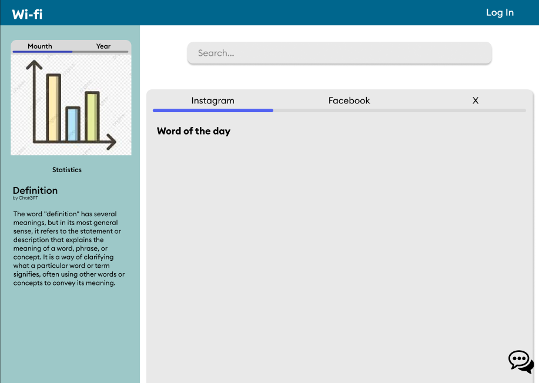
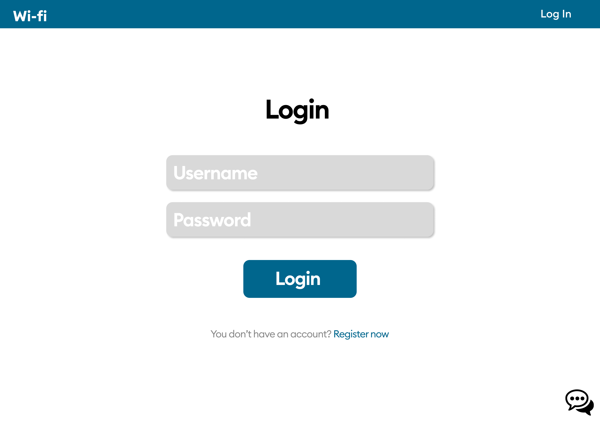
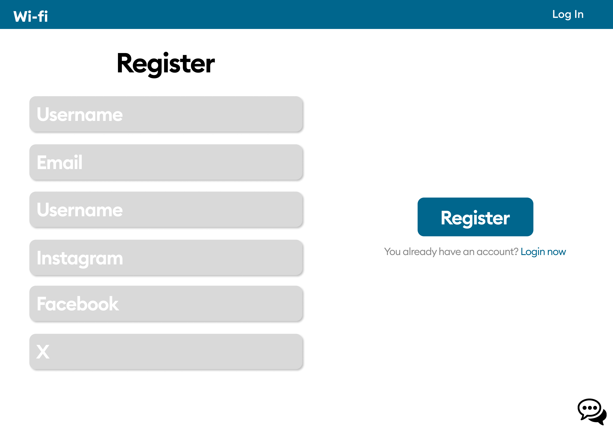
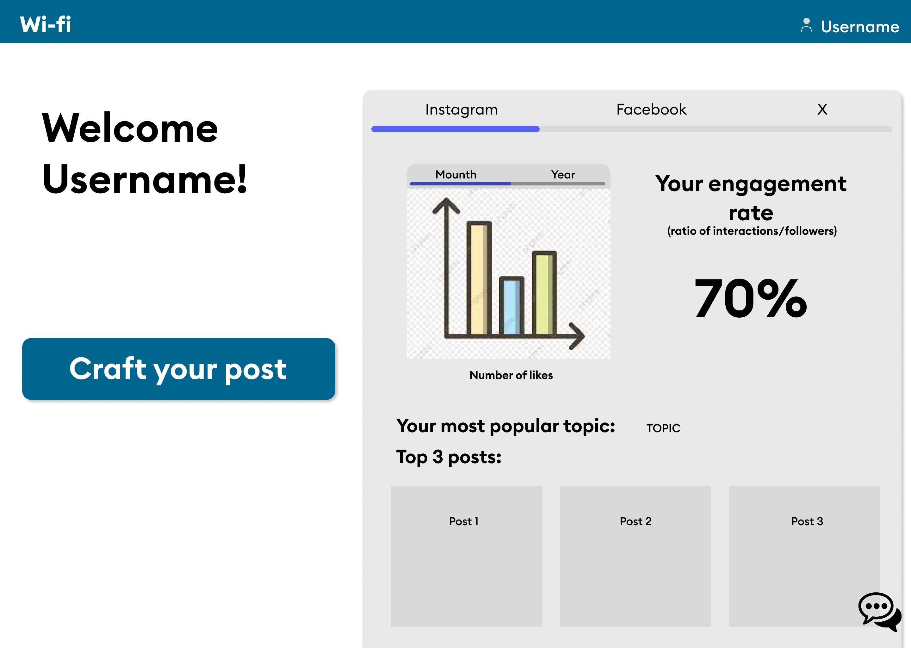
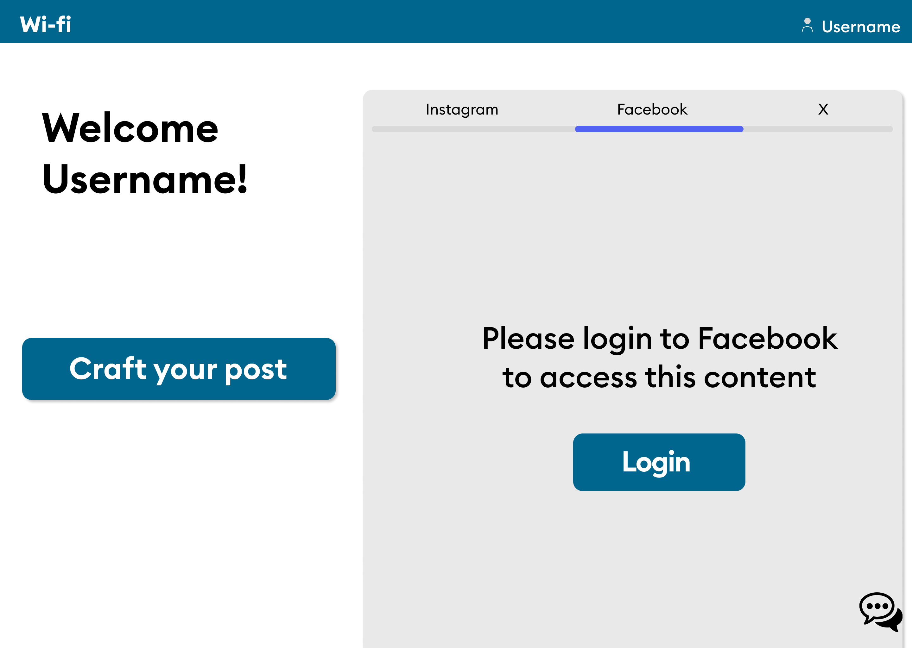
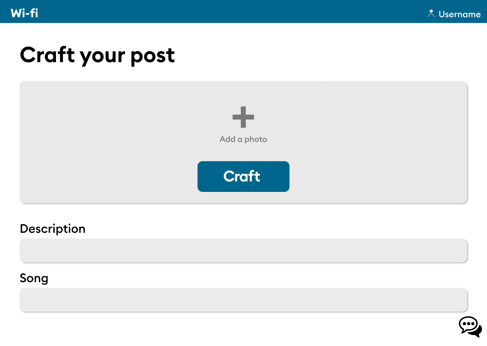

# Figma Link
https://www.figma.com/file/Uh9vPARq5iD8mRhU4EEG5T/Untitled?type=design&node-id=0%3A1&mode=design&t=Pcyr72X5dgWLsinH-1

## Colours:
App bar colour:  `#2F668D` 
Background colour:  `#FFFFFF`  
Search bar and toggle group colour:  `#E9E9E9`  
Socials toggle buttons margin colour:  `#DADADA`  
Socials toggle buttons margin colour (hover):  `#5C62EC`  
Graphs toggle buttons margin colour:  `#4446A5`  
Left container colour:  `#A6C8C9`   

## Font:
https://fonts.google.com/specimen/Inter?preview.text=WiFi  
Css rule: `font-family: 'Inter', sans-serif;`  
Font colour: Alternates between black and white.  

# Main Page:
  
# Login:
  
# Register:
  
# User Page:
  
# User Page not Logged in:
  
# Craft Your Post:

